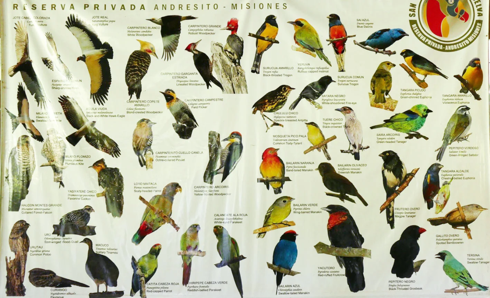

# Bird_classification_with_ResNet101

## Overview
This project amis to classify the bird's type among 200 class.

**About the dataset [1]** ([Download the dataset](https://www.kaggle.com/datasets/xiaojiu1414/cub-200-2011))

The Caltech-UCSD Birds-200-2011 (CUB-200-2011) dataset is the most widely-used dataset for fine-grained visual categorization task. It contains 11,788 images of 200 subcategories belonging to birds, 5,994 for training and 5,794 for testing. Each image has detailed annotations: 1 subcategory label, 15 part locations, 312 binary attributes and 1 bounding box. The textual information comes from Reed et al.. They expand the CUB-200-2011 dataset by collecting fine-grained natural language descriptions. Ten single-sentence descriptions are collected for each image. The natural language descriptions are collected through the Amazon Mechanical Turk (AMT) platform, and are required at least 10 words, without any information of subcategories and actions.

**Dataset description:**
- Number of categories: 200
- Number of images: 11,788
- Annotations per image: 
  - 15 Part Locations
  - 312 Binary Attributes 
  - 1 Bounding Box

